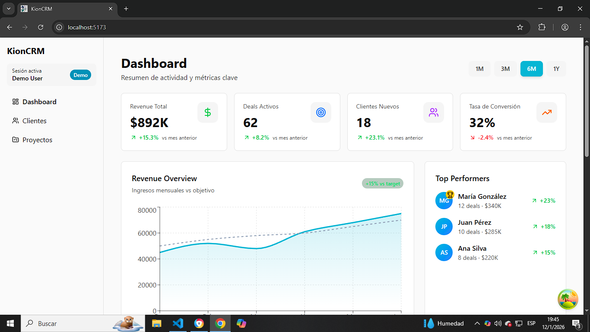
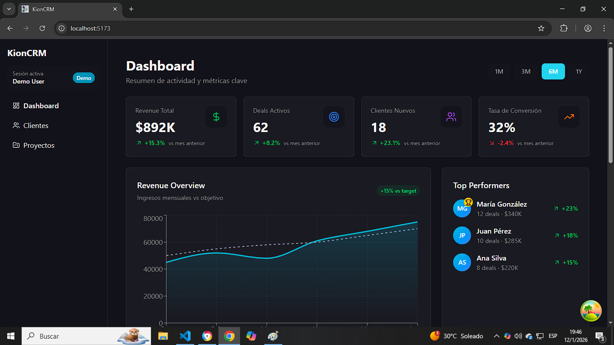
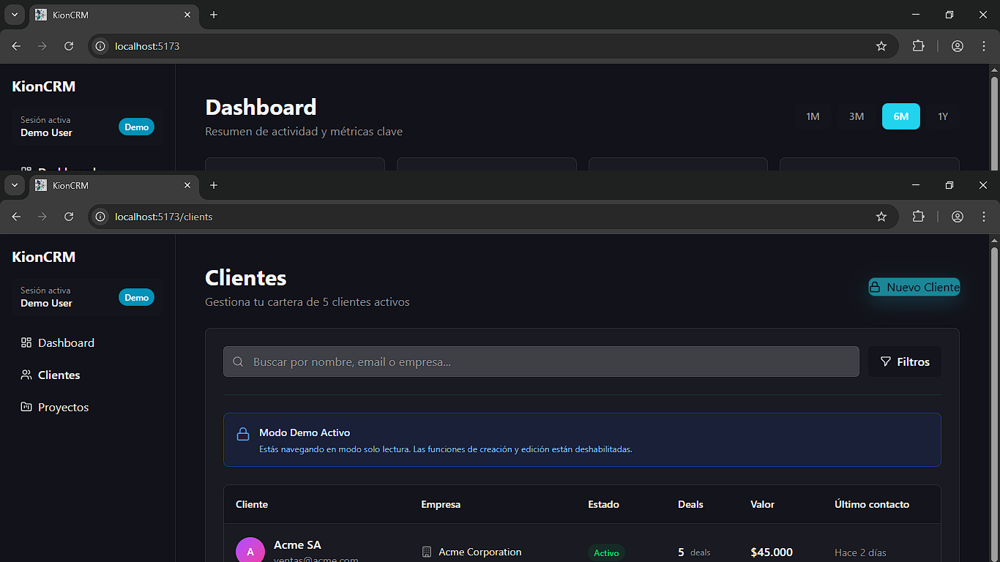
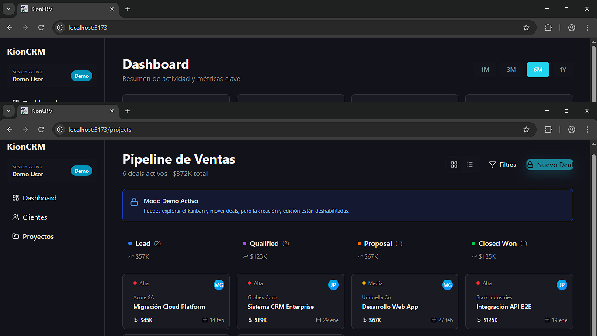

# 🚀 KionCRM

**Modern CRM built with React, TypeScript, and .NET**

A full-stack Customer Relationship Management system designed for small to medium-sized businesses. Built with modern technologies and best practices, featuring a clean UI, dark mode support, and real-time updates.

---

## ✨ Features

### 🎨 **Modern UI/UX**
- Clean, professional interface with Teal/Cyan color palette
- Full dark mode support with smooth transitions
- Responsive design (desktop, tablet, mobile)
- Loading skeletons for better perceived performance
- Toast notifications for user feedback

### 👥 **Client Management**
- Complete client database with search and filtering
- Client details with contact information
- Activity tracking and deal history
- Real-time client creation with validation

### 📊 **Sales Pipeline**
- Interactive Kanban board with drag & drop
- 4-stage pipeline (Lead → Qualified → Proposal → Closed Won)
- Deal cards with priority levels and value tracking
- Alternative list view for quick overview

### 📈 **Dashboard & Analytics**
- Revenue overview with monthly tracking
- Quick stats (Total Revenue, Active Deals, New Clients, Conversion Rate)
- Top performers leaderboard
- Recent activity feed
- Sales pipeline visualization

### 🔐 **Authentication & Roles**
- Role-based access control (Admin & Demo modes)
- Demo mode with read-only access
- Protected routes and restricted actions
- Persistent authentication with localStorage

### 🎭 **Demo Mode**
- Full exploration without data modification
- Informative banners and tooltips
- Disabled create/edit actions with helpful feedback
- Drag & drop enabled for interaction

---

## 🛠️ Tech Stack

### **Frontend**
- **React 18.3** - UI library
- **TypeScript 5.6** - Type safety
- **Vite 7.2** - Build tool & dev server
- **Tailwind CSS 4.0** - Utility-first styling
- **shadcn/ui** - Component library
- **React Router 7.1** - Client-side routing
- **Recharts** - Data visualization
- **@dnd-kit** - Drag and drop functionality
- **Sonner** - Toast notifications
- **Lucide React** - Icon library

### **Backend** *(In Development)*
- **.NET 7/8** - Web API
- **Entity Framework Core** - ORM
- **SQL Server / PostgreSQL** - Database
- **JWT** - Authentication

---

## 🚀 Getting Started

### **Prerequisites**
- Node.js 18+ and npm
- Git

### **Installation**

1. **Clone the repository**
   ```bash
   git clone https://github.com/LautaroSnchz/kion-crm.git
   cd kion-crm
   ```

2. **Install frontend dependencies**
   ```bash
   cd frontend
   npm install
   ```

3. **Run the development server**
   ```bash
   npm run dev
   ```

4. **Open your browser**
   ```
   http://localhost:5173
   ```

---

## 🎭 Demo Credentials

### **Admin Access**
- Email: `admin@kioncrm.com`
- Password: `Admin123!`

### **Demo Mode**
- Click "Acceder como Demo" button
- Read-only access with full exploration

---

## 📸 Screenshots

### Dashboard (Light Mode)

*Revenue overview, quick stats, and top performers*

### Dashboard (Dark Mode)

*Full dark mode support with adaptive colors*

### Clients Management

*Client database with search and filtering*

### Sales Pipeline (Kanban)

*Interactive drag & drop deal management*

---

## 🗂️ Project Structure

```
kion-crm/
├── frontend/
│   ├── src/
│   │   ├── components/
│   │   │   ├── layout/          # AppLayout, Sidebar, Topbar
│   │   │   ├── modals/          # NewClientModal, NewDealModal
│   │   │   └── ui/              # shadcn components + Skeletons
│   │   ├── features/
│   │   │   ├── auth/            # SignIn page
│   │   │   ├── clients/         # ClientsPage
│   │   │   ├── dashboard/       # DashboardPage
│   │   │   └── projects/        # ProjectsPage (Pipeline)
│   │   ├── hooks/               # useAuth custom hook
│   │   ├── types/               # TypeScript definitions
│   │   └── index.css            # Global styles + theme
│   ├── public/                  # Static assets
│   └── package.json
├── backend/                     # (Coming soon)
└── docs/
```

---

## 🎨 Color Palette

**Primary (Teal/Cyan):**
- Light mode: `#06B6D4` (Cyan 500)
- Dark mode: `#22D3EE` (Cyan 400)

**Why Teal?**
Changed from purple to differentiate from AI-generated aesthetics and better suit a professional CRM context.

---

## ✅ Completed Features

- [x] Authentication system with roles
- [x] Client management (CRUD)
- [x] Deal/Project pipeline with Kanban
- [x] Dashboard with analytics
- [x] Dark/Light mode toggle
- [x] Demo mode with restrictions
- [x] Loading skeletons
- [x] Toast notifications
- [x] Form validations
- [x] Responsive design
- [x] Modal dialogs
- [x] Drag & drop

---

## 🚧 Roadmap

### **Phase 1: Frontend (98% Complete)** ✅
- [x] Core UI components
- [x] Authentication & routing
- [x] Client management
- [x] Sales pipeline
- [x] Dashboard & analytics
- [x] Demo mode
- [x] Loading states
- [ ] Empty states
- [ ] Error boundaries

### **Phase 2: Backend (In Progress)**
- [ ] .NET Web API setup
- [ ] Database design (EF Core)
- [ ] JWT authentication
- [ ] CRUD endpoints
- [ ] Data validation
- [ ] API documentation

### **Phase 3: Integration**
- [ ] Connect frontend to API
- [ ] Real-time updates
- [ ] File uploads
- [ ] Export functionality
- [ ] Email notifications

### **Phase 4: Deployment**
- [x] Frontend on Vercel
- [ ] Backend on Azure/Railway
- [ ] Database in cloud
- [ ] CI/CD pipeline
- [ ] Monitoring & logging

### **Phase 5: Advanced Features**
- [ ] Advanced analytics
- [ ] Custom reports
- [ ] Email integration
- [ ] Calendar sync
- [ ] Mobile app

---

## 🤝 Contributing

This is a portfolio project, but feedback and suggestions are welcome!

1. Fork the repository
2. Create a feature branch (`git checkout -b feature/AmazingFeature`)
3. Commit your changes (`git commit -m 'Add some AmazingFeature'`)
4. Push to the branch (`git push origin feature/AmazingFeature`)
5. Open a Pull Request

---

## 📝 License

This project is open source and available under the [MIT License](LICENSE).

---

## 👨‍💻 Author

**Lautaro Sánchez**

- GitHub: [@LautaroSnchz](https://github.com/LautaroSnchz)
- LinkedIn: [Add your LinkedIn]
- Email: [Add your email]

---

## 🙏 Acknowledgments

- [shadcn/ui](https://ui.shadcn.com/) - Component library
- [Tailwind CSS](https://tailwindcss.com/) - Styling framework
- [Recharts](https://recharts.org/) - Chart library
- [dnd-kit](https://dndkit.com/) - Drag and drop
- [Lucide](https://lucide.dev/) - Icon library

---

## 📊 Project Stats

- **Frontend Completion:** 98%
- **Total Lines of Code:** ~15,000+
- **Components:** 25+
- **Pages:** 4 (Dashboard, Clients, Projects, SignIn)
- **Development Time:** 3 weeks

---

**⭐ If you found this project helpful, please consider giving it a star!**

---

*Built with ❤️ using React, TypeScript, and modern web technologies*
